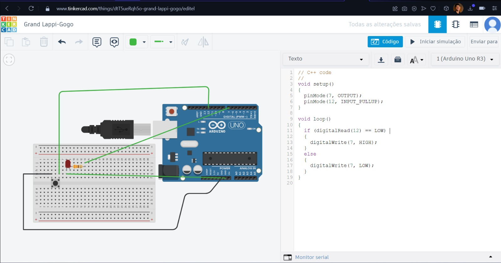

## Entrega da parte 2 da ponderada da semana 1

Segue a imagem do tinkercad que conta com a estrutura e código.

Foto 
 

Foto 
 

## Entendimento

Quando o botão é precionado, o led será ligado, ao passo que quando o botão é solto, o led será desligado.